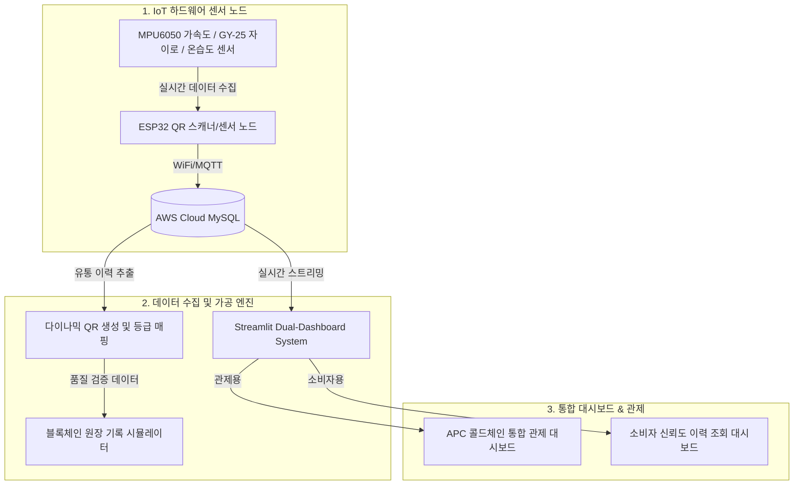

# ❄️ ColdChain-DigitalTwin-Platform

> **수확 후 농산물의 신선도 보장을 위한 양방향 디지털 트윈 기반 실시간 유통 관제 및 신뢰성 검증(블록체인) 플랫폼**

---

## 📌 프로젝트 개요 (Overview)
본 플랫폼은 산지유통센터(APC)에서 출고된 신선 농산물이 최종 소비자에게 도달하기까지의 전 과정(Cold-Chain)을 **실시간 IoT 센서 데이터 수집, 다이나믹 QR 코드, 디지털 트윈 가시화, 블록체인 원장 기록**을 통해 모니터링하고 가치를 보장하는 통합 유통 추적 솔루션입니다.

* **연구 분야**: 생산정보 연계 농산물 수확 후 품질 표준화 및 양방향 디지털 트윈 관제
* **핵심 타겟**: APC 관리자(차량 노선 우회, 실시간 저장고 온도 조절) & 소비자(유통 이력, 신선 품질 신뢰성 조회)

---

## 🏗️ 시스템 아키텍처 (System Architecture)



---

## 🌟 핵심 기능 (Key Features)

1. **양방향 디지털 트윈 관제**: 운송 차량 내부의 온습도, 실시간 GPS 및 3축 가속도/자이로 센서를 매핑하여 차량 충격에 의한 농산물 손상량을 실시간 예측 및 최적화 노선 우회 제안.
2. **다이나믹 QR 코드 & 데이터 매핑**: 유통 구간별 상태 변화 정보를 동적으로 QR에 주입하고, 누락되거나 소실된 QR 배송 이력을 데이터베이스로부터 고화질 품질 등급(특/상/보통) 및 브랜드 로고와 함께 복구하는 자동화 파이프라인 탑재.
3. **블록체인 기반 이력 신뢰성 검증**: 데이터 위변조 방지를 위해 수집된 운송 및 품질 정보를 블록체인 트랜잭션 형태로 로컬 원장(`blockchain_ledger.json`)에 기록 및 동기화.
4. **듀얼 관제 시스템**: Streamlit 프레임워크를 기반으로 APC 물류 마스터용 화면과, 일반 소비자가 스마트폰 QR 스캔을 통해 "몇 시간 전 어디서 출고되어 어떤 온도 관리를 받았는지"를 즉시 조회하는 소비자 화면의 분리 구현.

---

## 📂 디렉터리 구성 (Directory Structure)

본 프로젝트는 프로토타입 연구 개발 단계부터 최종 실험실(PoC) 완성 단계까지의 전체 여정을 담고 있습니다.

### 🏆 1. [Final_Experiment/](./Final_Experiment/) (최종 완성 PoC)
실험실 단계에서 최종 검증을 마친 안정 버전의 시스템입니다.
* `1_PC_QR_Generators/`: 브랜드 로고 및 품질 등급 연계 다이나믹 QR 자동 생성 엔진.
* `2_ESP32_Firmware/`: OLED가 없는 경량 하드웨어용 Multi-WiFi 및 보안 Secrets 헤더 포함 스캔/송신 펌웨어.
* `3_Consumer_Dashboard/`: 소비자가 한눈에 KST 기준 정확한 운송 경과 시간과 품질 등급을 확인하는 대시보드.
* `4_APC_Coldchain_Dashboard/`: 관제용 대시보드 시스템.
* `QR_Recovery_Script.py`: 데이터베이스 정밀 쿼리를 통한 QR 코드 일괄 자동 복구 유틸리티.

### 🧪 2. [Hardware_Prototypes/](./Hardware_Prototypes/) (센서/레거시 샌드박스)
다양한 IoT 환경과 센서 피팅을 연구했던 과거 하드웨어 개발 역사와 실험 자료를 보관하는 공간입니다.
* `coldchain_module`: 온습도/충격 감지 기본 ESP32 모듈 기초 설계 소스.
* `coldchain_module_gy25` / `gy521`: GY-25 자이로 및 MPU6050 센서 연동 캘리브레이션 테스트 샌드박스.
* `qr_scanner_module`: 아두이노 기반 바코드/QR 스캐너 트리거 및 수집 모듈.
* `code26/`: 초기 학습 및 실험 코딩 소스.

### 📄 3. [KSHS/](./KSHS/) (학술 발표 및 학회 성과 아카이브)
* 본 기술 플랫폼의 독창성과 학술적 기여를 인정받은 **한국원예학회(KSHS)** 제출 최종 초록, 포스터(PDF/HTML), 그리고 슬라이드 PPTX 파일이 들어있습니다.

---

## 🛠️ 시작 가이드 (Quick Start)

### 1. 환경 설정 (Dependencies)
Python 3.10+ 환경에서 다음 명령어를 실행하여 필수 패키지를 설치합니다:
```bash
pip install -r requirements.txt
```

### 2. 소비자 대시보드 구동
```bash
cd Final_Experiment/3_Consumer_Dashboard
streamlit run Step5_Run_Dashboard.py
```

### 3. QR 복구 스크립트 실행
```bash
cd Final_Experiment
python QR_Recovery_Script.py
```

---

## 👨‍🔬 담당 연구 및 연락처
* **한성민 ( 전북대학교 농업기계공학과 / 석사과정 )**
* **Agricultural Sensor and Robotics Lab** 학부연구생 3년 & 석사 1년차
* 📧 **Contact**: `yuyu6243@gmail.com`