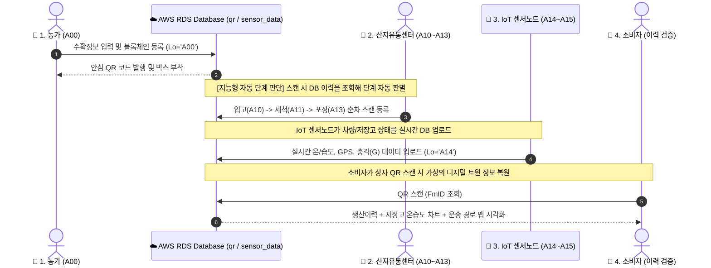

# ❄️ 콜드체인 디지털 트윈(FDT) 플랫폼 전체 유통 프로세스 가이드

본 문서는 농장에서 과일이 수확되어 산지유통센터(APC)를 거치고, 최종 소비자에게 도달하기까지의 전 과정(A00 ~ A15)을 추적하는 **양방향 디지털 트윈(FDT) 플랫폼의 전체 유통 프로세스 및 데이터 연동 규격**을 정리한 가이드라인입니다.

---

## 🏗️ 1. 전체 시스템 아키텍처 및 데이터 흐름

---

## 📝 2. 유통 단계별 상세 물리-디지털 트윈 흐름

### 🚜 A00. 농장 수확 및 데이터 등록 (수확 단계)
* **물리적 행위:** 농가에서 과일을 수확하고 포장 상자 단위로 수확 정보를 작성합니다.
* **디지털 트윈 연동:**
  1. 농민이 GUI 프로그램([Step1_Farm_QR_Creator.py](file:///c:/Users/korea/Desktop/1hsm/hanhanhan/ColdChain-DigitalTwin-Platform/Final_Experiment/1_PC_QR_Generators/Step1_Farm_QR_Creator.py))을 실행하여 농가 ID(`FmID`), 지역 코드(`AC`), 품종(`Vt`), 수량(`Qt`) 등을 입력합니다.
  2. 시스템은 입력된 데이터의 해시값(SHA-256)을 생성하여 로컬 블록체인 원장(`blockchain_ledger.json`)에 등록합니다.
  3. 원본 정보는 AWS RDS `qr` 테이블에 `Lo='A00'` 레코드로 삽입됩니다.
  4. 개별 과일 상자에 부착할 **고유 안심 QR 코드 이미지**가 생성됩니다.

---

### 🏢 A10. APC 입고 (수하 단계)
* **물리적 스캔 상황:** 과일 상자가 농가에서 유통센터(APC) 하역장에 도착하여 첫 적재될 때, 작업자가 상자 겉면의 안심 QR 코드를 MQ160W 스캐너로 조준하여 스캔합니다.
* **MQ160W 스캔 동작 및 전송:** 
  1. 스캐너 트리거를 당기면 CMOS 센서가 QR 이미지를 해석하여 URL 문자열(예: `https://.../?FmID=33&AC=55630...`)을 무선 2.4GHz 신호로 동글에 쏩니다.
  2. 젯슨/PC에 꽂힌 무선 동글이 신호를 즉시 입력 데이터로 변환하여 수신 대기 중인 파이썬 스크립트(또는 아두이노 프로그램)로 전달합니다.
* **시스템 내부 처리 흐름:**
  1. **파라미터 추출:** 수신한 문자열에서 농가 ID(`FmID = 33`) 및 기본 원예 속성(`AC`, `FrT`, `Vt` 등)을 파싱합니다.
  2. **이전 이력 조회:** DB `qr` 테이블에서 `FmID = 33`의 최종 상태를 검색합니다. 최초 스캔이므로 반환값은 `Lo='A00'`(또는 이력 없음)입니다.
  3. **자동 단계 매핑:** 최종 상태가 `A00`이므로, 프로그램은 이번 스캔을 자동으로 **`A10` (입고 단계)**로 규정합니다.
  4. **센서 좌표 연계:** `sensor_data` 테이블에서 가장 최근 수신된 입고장의 GPS 위경도 정보(`Lat`, `lon`)를 조회합니다.
  5. **DB 저장:** 현재 시각(`APC_AD = NOW()`) 및 GPS 좌표를 포함한 `A10` 입고 레코드를 신규 추가합니다.
     * `INSERT INTO qr (Lo, AC, FmID, FrT, Vt, Ct, HD, DD, Qt, Mt, HN, StD, Rp, APC_AD, Lat, lon) VALUES ('A10', ..., NOW(), lat, lon)`
* **디지털 트윈 동기화 결과:** 
  * DB 저장 성공과 동시에 최종 소비자가 스캔해서 보게 될 대시보드의 타임라인 상에서 **'🌱 농장 수확'**에 이어 **'🏢 입고 완료'** 항목이 밝은 녹색으로 활성화되며 정확한 입고 시간 정보가 동기화됩니다.

---

### 💦 A11. 세척 완료 (가공 단계)
* **물리적 스캔 상황:** 과일 상자가 세척 컨베이어 벨트를 모두 통과해 세척실 출구로 나올 때, 라인 담당자가 MQ160W로 QR 코드를 스캔합니다.
* **MQ160W 스캔 동작 및 전송:** 
  * 스캐너가 QR 코드를 고속 스캔하여 젯슨/PC로 문자열을 무선 전송합니다.
* **시스템 내부 처리 흐름:**
  1. **파라미터 추출:** 수신 데이터에서 상자 고유 번호(`FmID = 33`)를 추출합니다.
  2. **이전 이력 조회:** DB `qr` 테이블에서 `FmID = 33`으로 최종 등록된 상태(`Lo`)를 파악합니다. 결과로 `Lo='A10'`(입고 완료) 상태가 확인됩니다.
  3. **자동 단계 매핑:** 이전 최종 단계가 `A10`이므로, 시스템은 이번 입력을 자동으로 **`A11` (세척 완료 단계)**로 판정합니다.
  4. **DB 저장 (데이터 연속성):** 기존 `A10` 레코드에 채워진 농가 정보와 GPS 좌표를 복사하고, 세척 완료 필드(`APC_WD`)만 현재 시각(`NOW()`)으로 채워 새로운 세척 완료 레코드를 DB에 삽입합니다.
     * `INSERT INTO qr (Lo, AC, FmID, ..., APC_AD, APC_WD, Lat, lon) SELECT 'A11', AC, FmID, ..., APC_AD, NOW(), lat, lon FROM qr WHERE FmID = 33 AND Lo = 'A10'`
* **디지털 트윈 동기화 결과:** 
  * 소비자 안심 이력서 화면 상의 **'💦 세척 완료'** 구간이 체크 표시되며 가상의 상태 정보가 연동 완료됩니다.

---

### 🔍 A12. 품질 선별 (품질 판정 단계)
* **물리적 상황:** 과일들이 비파괴 당도 선별 및 크기 분류 컨베이어 벨트를 거쳐 각 등급별로 분류됩니다.
* **디지털 트윈 연동:**
  * 이 단계는 수동 스캐너 동작이 배제되고, 선별 시스템이 동작 완료 시점(`APC_RT = NOW()`) 및 분류된 등급 수량을 DB에 직접 기록합니다.

---

### 📦 A13. 포장 완료 (최종 패키징 단계)
* **물리적 스캔 상황:** 등급 판정이 완료된 과일들이 출하용 박스에 소포장된 후, 포장실 담당자가 MQ160W 스캐너로 상자의 QR 코드를 최종 스캔합니다.
* **MQ160W 스캔 동작 및 전송:** 스캔 완료 시 무선 통신을 통해 데이터가 실시간 젯슨/PC로 인입됩니다.
* **시스템 내부 처리 흐름:**
  1. **파라미터 추출:** 스캔 결과에서 `FmID = 33`을 파싱합니다.
  2. **이전 이력 조회:** DB를 조회해 이 상자의 최신 이력이 `Lo='A11'`(세척 완료) 또는 선별기 자동화 시스템이 등록해 둔 `Lo='A12'`(선별 완료)인 것을 식별합니다.
  3. **자동 단계 매핑:** 최종 상태가 `A11` 또는 `A12`이므로, 이번 스캔은 자동으로 **`A13` (포장 완료 단계)**로 분류됩니다.
  4. **등급 데이터 결합:** 선별 테이블에서 해당 상자 batch에 할당된 선별 등급 통계(`AGrade`, `BGrade`, `CGrade`, `DefectRate`) 데이터를 끌어옵니다.
  5. **DB 저장:** 세척/선별 완료 기록들에 등급 정보 및 포장 완료 시각(`APC_PT = NOW()`)을 합산하여 신규 행으로 저장합니다.
     * `INSERT INTO qr (Lo, ..., APC_PT, Lat, lon, AGrade, BGrade, CGrade, DefectRate) SELECT 'A13', ..., NOW(), lat, lon, AGrade, BGrade, CGrade, DefectRate FROM qr WHERE FmID = 33 AND Lo = 'A11' (또는 A12) ORDER BY id DESC LIMIT 1`
* **디지털 트윈 동기화 결과:** 
  * 이력이 **'📦 포장 완료'** 상태로 업데이트되며, 소비자는 자신이 구입하는 상자의 등급 판정 결과(예: 상 등급, 불량률 1.2% 등)를 가상 대시보드에서 투명하게 읽을 수 있게 됩니다.

---

### ❄️ A14. 저온 저장 (보관 및 환경 모니터링 단계)
* **물리적 스캔 상황:** 포장된 과일 박스가 저온 창고(Cold Storage) 입구로 들어가 보관 위치에 놓일 때, 보관 담당자가 MQ160W로 QR 코드를 스캔합니다.
* **MQ160W 스캔 동작 및 전송:** QR 코드의 URL 정보가 무선으로 전송되어 젯슨/PC에 입력됩니다.
* **시스템 내부 처리 흐름:**
  1. **파라미터 추출:** `FmID = 33`을 추출합니다.
  2. **이전 이력 조회:** DB를 검색하여 이 상자의 마지막 유통 이력이 `Lo='A13'`(포장 완료)임을 감지합니다.
  3. **자동 단계 매핑:** 마지막 상태가 `A13`이므로, 시스템은 이번 행동을 **`A14` (저온 저장 단계)**로 자동 간주합니다.
  4. **실시간 기상 센서 트윈 동기화:** 저장 창고 내부 온도/습도를 24시간 수집하는 SHT45 센서의 DB 레코드(`sensor_data` 테이블)로부터 **스캔 시점의 실시간 보관 온도(`Tp`)와 습도(`Hm`)** 값을 즉시 로드합니다.
  5. **DB 저장:** 저장고 입고 시각(`APC_StD = NOW()`) 및 동기화된 실시간 온습도 데이터를 포함하여 새로운 보관 기록 레코드를 저장합니다.
     * `INSERT INTO qr (Lo, ..., APC_StD, Tp, Hm, Lat, lon) SELECT 'A14', ..., NOW(), tp, hm, lat, lon FROM qr WHERE FmID = 33 AND Lo = 'A13' ORDER BY id DESC LIMIT 1`
* **디지털 트윈 동기화 결과:** 
  * 대시보드 내 **'❄️ 저온 저장'** 타임라인이 동작하며, 보관 동안의 누적 온도 및 습도가 센서 연계 3D 실시간 대시보드 및 소비자 안심 그래프에 가상 동기화 형태로 렌더링되기 시작합니다.

---

### 🚛 A15. 최종 출하 (수송 단계)
* **물리적 스캔 상황:** 저온 보관을 마친 박스가 냉장 탑차에 상차되어 판매지로 떠나는 순간, 유통센터 출구 하역장에서 출하 담당자가 마지막으로 MQ160W로 QR 코드를 스캔합니다.
* **MQ160W 스캔 동작 및 전송:** QR 코드가 스캔되며 젯슨/PC로 데이터 수신 처리가 이루어집니다.
* **시스템 내부 처리 흐름:**
  1. **파라미터 추출:** `FmID = 33`을 확인합니다.
  2. **이전 이력 조회:** DB를 검색해 이 상자의 직전 이력이 `Lo='A14'`(저온저장 중)인 것을 조회해 냅니다.
  3. **자동 단계 매핑:** 최종 상태가 `A14`이므로, 시스템은 이번 스캔을 최종 단계인 **`A15` (최종 출하 단계)**로 매핑합니다.
  4. **DB 저장:** 출하 시작 시각(`APC_OP = NOW()`) 및 관련 출하 데이터를 AWS DB에 최종 기입합니다.
     * `INSERT INTO qr (Lo, ..., APC_OP, Lat, lon) SELECT 'A15', ..., NOW(), lat, lon FROM qr WHERE FmID = 33 AND Lo = 'A14' ORDER BY id DESC LIMIT 1`
* **디지털 트윈 동기화 결과:** 
  * 관제 대시보드와 소비자 화면이 실시간으로 동기화되어 배송 차량 내 GPS 이동 동선 및 차량 센서 노드([main_c3.cpp](file:///c:/Users/korea/Desktop/1hsm/hanhanhan/ColdChain-DigitalTwin-Platform/Hardware_Prototypes/coldchain_module_gy521/src/main_c3.cpp))가 수집하는 실시간 실내/외 충격 및 기상 트래킹 정보가 활성화된 모빌리티 트윈으로 전이됩니다.

---

## 🍏 3. 소비자 이력 검증 및 안심 이력서

소비자가 최종적으로 상품 포장에 붙은 QR 코드를 자신의 스마트폰 카메라로 스캔하면 모바일 브라우저를 통해 **소비자 안심 대시보드**([Step5_Run_Dashboard.py](file:///c:/Users/korea/Desktop/1hsm/hanhanhan/ColdChain-DigitalTwin-Platform/Final_Experiment/3_Consumer_Dashboard/Step5_Run_Dashboard.py))에 접속됩니다.

1. **가상 타임라인 시각화:** 소비자는 과일이 언제 수확되어 언제 세척, 포장, 저장, 출하되었는지 KST(한국 표준시) 기준으로 일목요연하게 표시된 이력을 확인합니다.
2. **저장 환경 검증:** 저온 저장 단계(`A14`) 동안 보관 온도와 습도가 최적으로 관리되었는지 실시간 온습도 데이터를 그래프로 검증합니다.
3. **이동 궤적 추적:** 젯슨과 연동된 수송 트럭의 GPS 좌표를 추적하여 실제 산지에서 내 식탁까지 도달한 물리적 지리 동선을 지도로 투명하게 확인합니다.
4. **블록체인 무결성 확인:** 현재 DB의 정보가 최초 수확 등록 시점에 기록되었던 해시 원장(`blockchain_ledger.json`)과 완벽히 일치하는지 자동 검증하여 신뢰성을 확보합니다.

---

## ⚙️ 4. 지능형 자동 단계 판단 (Method 2) 상세 로직 디자인

스마트폰 리모컨 조작 없이 오직 **무선 스캐너(MQ160W) 스캔 행위만으로** 단계를 누적하기 위한 조건 분기 설계 구조입니다.

| 스캔 전 DB 최신 상태 (`Lo`) | 판단된 수집 단계 | 적용 쿼리 및 동작 매핑 |
| :--- | :---: | :--- |
| **이력 없음** 또는 **`A00`** | **`A10` (입고)** | `INSERT INTO qr (Lo, ..., APC_AD, Lat, lon) VALUES ('A10', ..., NOW(), lat, lon)` |
| **`A10`** | **`A11` (세척)** | `INSERT INTO qr (Lo, ..., APC_WD, Lat, lon) SELECT 'A11', ..., NOW(), lat, lon FROM qr WHERE FmID = %s` |
| **`A11`** 또는 **`A12`** | **`A13` (포장)** | `INSERT INTO qr (Lo, ..., APC_PT, Lat, lon, AGrade, ...) SELECT 'A13', ..., NOW(), lat, lon, AGrade, ...` |
| **`A13`** | **`A14` (저온저장)**| `INSERT INTO qr (Lo, ..., APC_StD, Tp, Hm, Lat, lon) SELECT 'A14', ..., NOW(), tp, hm, lat, lon` |
| **`A14`** | **`A15` (최종출하)**| `INSERT INTO qr (Lo, ..., APC_OP, Lat, lon) SELECT 'A15', ..., NOW(), lat, lon` |
| **`A15`** | **종료** | 스캔 데이터를 DB에 입력하지 않고, 젯슨 터미널에 "이미 출하가 끝난 상품입니다." 알림 출력 |

---

## 🔌 5. 무선 QR 스캐너 (MQ160W) 연동 규격

본 플랫폼은 산지유통센터(APC) 내 스캔 자동화를 위해 유/무선 CMOS 2D/QR 바코드 스캐너인 **MQ160W**를 젯슨(Jetson) 및 PC와 결합하여 사용합니다.

### 1) 하드웨어 연결 방식
* **무선 동글 연결:** MQ160W와 기본 매칭되어 출고되는 **USB 무선 수신기(동글)**를 젯슨의 USB 포트에 삽입합니다. 젯슨 운영체제(Ubuntu Linux)에서는 별도의 블루투스 설정이나 드라이버 설치 없이 하드웨어 레벨에서 무선 입력 신호가 즉시 수신됩니다.
* **유선 및 충전:** 필요시 동봉된 USB Type-A to Type-B 케이블을 사용하여 젯슨에 직접 유선으로 통신하고 충전할 수 있습니다.

### 2) 젯슨 프로그램 데이터 수신 방식 (선택 가능)

| 구분 | ① USB HID (키보드) 방식 | ② USB VCP (가상 시리얼) 방식 |
| :--- | :--- | :--- |
| **개요** | 스캐너가 일반 무선 USB 키보드처럼 동작하여 터미널에 스캔 문자열 + 엔터(`Enter`)를 입력하는 방식 | 스캐너를 가상 컴포트 장치로 설정하여 전용 시리얼 라인으로만 데이터를 송수신하는 방식 |
| **동작 설정** | 스캐너 기본 공장 출고값 상태 | MQ160W 설정 매뉴얼 내 **"USB 가상 시리얼 포트(Virtual COM)"** 바코드 스캔 필요 |
| **젯슨 감지 경로** | `/dev/input/event*` (인풋 이벤트) | `/dev/ttyACM*` 또는 `/dev/ttyUSB*` (시리얼 장치) |
| **장점** | 특별한 드라이버나 복잡한 통신 코드 없이 터미널 집중 상태에서 즉각적인 테스트가 가능함 | 프로그램이 백그라운드 서비스(Systemd)로 돌아갈 때, 터미널 화면의 포커스 여부와 무관하게 100% 신뢰성 있게 수집 가능 |
| **파이썬 라이브러리**| `evdev` 또는 표준 입력 `sys.stdin.readline` | `pyserial` |

