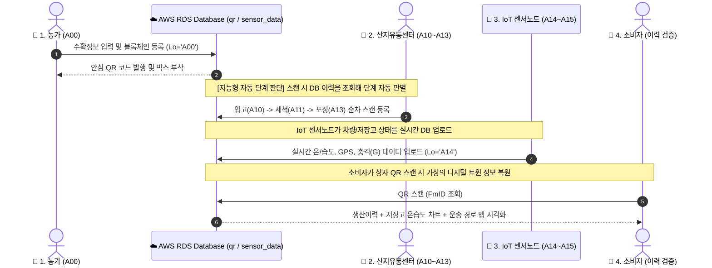

# ❄️ 콜드체인 디지털 트윈(FDT) 플랫폼 전체 유통 프로세스 가이드

본 문서는 농장에서 과일이 수확되어 산지유통센터(APC)를 거치고, 최종 소비자에게 도달하기까지의 전 과정(A00 ~ A15)을 추적하는 **양방향 디지털 트윈(FDT) 플랫폼의 전체 유통 프로세스 및 데이터 연동 규격**을 정리한 가이드라인입니다.

---

## 🏗️ 1. 전체 시스템 아키텍처 및 데이터 흐름

---

## 📝 2. 유통 단계별 상세 물리-디지털 트윈 흐름

### 🚜 A00. 농장 수확 및 데이터 등록 (수확 단계)
* **물리적 행위:** 농가에서 과일을 수확하고 포장 상자 단위로 수확 정보를 작성합니다.
* **디지털 트윈 연동:**
  1. 농민이 GUI 프로그램([Step1_Farm_QR_Creator.py](file:///c:/Users/korea/Desktop/1hsm/hanhanhan/ColdChain-DigitalTwin-Platform/Final_Experiment/1_PC_QR_Generators/Step1_Farm_QR_Creator.py))을 실행하여 농가 ID(`FmID`), 지역 코드(`AC`), 품종(`Vt`), 수량(`Qt`) 등을 입력합니다.
  2. 시스템은 입력된 데이터의 해시값(SHA-256)을 생성하여 로컬 블록체인 원장(`blockchain_ledger.json`)에 등록합니다.
  3. 원본 정보는 AWS RDS `qr` 테이블에 `Lo='A00'` 레코드로 삽입됩니다.
  4. 개별 과일 상자에 부착할 **고유 안심 QR 코드 이미지**가 생성됩니다.

---

### 🏢 A10. APC 입고 (수하 단계)
* **물리적 행위:** 과일 상자가 산지유통센터(APC) 하역장에 도착하면 스캐너로 QR을 인식합니다.
* **디지털 트윈 연동:**
  * 상자를 최초로 스캔하면 DB는 이 상자의 마지막 이력이 `A00`임을 확인하고 자동으로 다음 단계인 `Lo='A10'` 레코드를 삽입합니다.
  * 이때 입고 시각(`APC_AD = NOW()`)과 당시 입고장 GPS 위경도 정보가 매핑됩니다.

---

### 💦 A11. 세척 완료 (가공 단계)
* **물리적 행위:** 과일 상자가 세척 라인을 통과한 뒤 스캐너로 QR을 인식합니다.
* **디지털 트윈 연동:**
  * 상자 QR을 스캔하면 이전 상태(`A10`)를 읽어와 자동으로 `Lo='A11'` 레코드를 생성합니다.
  * 세척 공정 완료 시각(`APC_WD = NOW()`)이 데이터베이스에 실시간으로 업데이트됩니다.

---

### 🔍 A12. 품질 선별 (품질 판정 단계)
* **물리적 행위:** 자동 선별 시스템에 의해 크기, 당도, 결함 유무가 측정됩니다.
* **디지털 트윈 연동:**
  * 기계 혹은 자동 제어 프로그램에 의해 선별 완료 시각(`APC_RT = NOW()`) 및 분류된 수량 정보가 데이터베이스에 자동으로 누적됩니다.
  * *참고: 이 단계는 수동 스캐너 조작 없이 선별기 연동 프로그램을 통해 자동으로 이력이 진행됩니다.*

---

### 📦 A13. 포장 완료 (최종 패키징 단계)
* **물리적 행위:** 선별이 끝난 과일이 최종 출하용 상자에 포장된 후 스캐너로 QR을 인식합니다.
* **디지털 트윈 연동:**
  * 상자 QR을 스캔하면 최신 이력(`A11` 또는 `A12`)을 기반으로 자동으로 `Lo='A13'` 레코드가 생성됩니다.
  * 포장 완료 시각(`APC_PT = NOW()`)과 선별 과정에서 판정된 등급 정보(`AGrade`, `BGrade`, `CGrade`, `DefectRate`)가 기록에 통합됩니다.

---

### ❄️ A14. 저온 저장 (보관 및 환경 모니터링 단계)
* **물리적 행위:** 포장된 상자들이 APC 내 저온 보관고(Cold Storage)에 입고되며 스캐너로 QR을 인식합니다.
* **디지털 트윈 연동:**
  * QR 스캔 시 자동으로 `Lo='A14'` 레코드가 생성되고 저장 시작 시각(`APC_StD = NOW()`)이 기록됩니다.
  * **저장고 환경 트윈 동기화:** 저장고 내부에 부착된 온습도 센서가 스트리밍하여 기록하고 있던 데이터(`sensor_data` 테이블)로부터 **실시간 보관 온도(`Tp`)와 습도(`Hm`)** 값을 즉시 조회하여 이 상자의 저장 이력 정보에 결합(Insert)합니다.

---

### 🚛 A15. 최종 출하 (수송 단계)
* **물리적 행위:** 상품이 냉장 수송 트럭에 실려 소비지로 출발하기 직전 하역장에서 스캐너로 QR을 인식합니다.
* **디지털 트윈 연동:**
  * QR 스캔 시 유통의 최종 단계인 `Lo='A15'`가 기록되고 출하 시각(`APC_OP = NOW()`)이 업데이트됩니다.
  * **운송 환경 트윈 활성화:** 수송 트럭에 장착된 **IoT 센서 노드**([main_c3.cpp](file:///c:/Users/korea/Desktop/1hsm/hanhanhan/ColdChain-DigitalTwin-Platform/Hardware_Prototypes/coldchain_module_gy521/src/main_c3.cpp))가 운송 중 실시간 GPS 위치, 속도, 온습도, 3축 진동 충격량(`g_force`)을 MQTT를 통해 2초 주기로 전송합니다.
  * **통합 관제 트윈(FDT):** 관리자 화면([Step4_Run_Coldchain_v2.py](file:///c:/Users/korea/Desktop/1hsm/hanhanhan/ColdChain-DigitalTwin-Platform/Final_Experiment/4_APC_Coldchain_Dashboard/Step4_Run_Coldchain_v2.py))에서 트럭의 운송 경로를 3D 지도로 실시간 추적하며, 1.8G 이상의 차량 충격(도로 요철 등) 감지 시 지도에 경고 아이콘(🚨)을 표시하고 위험 온도를 관제합니다.

---

## 🍏 3. 소비자 이력 검증 및 안심 이력서

소비자가 최종적으로 상품 포장에 붙은 QR 코드를 자신의 스마트폰 카메라로 스캔하면 모바일 브라우저를 통해 **소비자 안심 대시보드**([Step5_Run_Dashboard.py](file:///c:/Users/korea/Desktop/1hsm/hanhanhan/ColdChain-DigitalTwin-Platform/Final_Experiment/3_Consumer_Dashboard/Step5_Run_Dashboard.py))에 접속됩니다.

1. **가상 타임라인 시각화:** 소비자는 과일이 언제 수확되어 언제 세척, 포장, 저장, 출하되었는지 KST(한국 표준시) 기준으로 일목요연하게 표시된 이력을 확인합니다.
2. **저장 환경 검증:** 저온 저장 단계(`A14`) 동안 보관 온도와 습도가 최적으로 관리되었는지 실시간 온습도 데이터를 그래프로 검증합니다.
3. **이동 궤적 추적:** 젯슨과 연동된 수송 트럭의 GPS 좌표를 추적하여 실제 산지에서 내 식탁까지 도달한 물리적 지리 동선을 지도로 투명하게 확인합니다.
4. **블록체인 무결성 확인:** 현재 DB의 정보가 최초 수확 등록 시점에 기록되었던 해시 원장(`blockchain_ledger.json`)과 완벽히 일치하는지 자동 검증하여 신뢰성을 확보합니다.

---

## ⚙️ 4. 지능형 자동 단계 판단 (Method 2) 상세 로직 디자인

스마트폰 리모컨 조작 없이 오직 **무선 스캐너(MQ160W) 스캔 행위만으로** 단계를 누적하기 위한 조건 분기 설계 구조입니다.

| 스캔 전 DB 최신 상태 (`Lo`) | 판단된 수집 단계 | 적용 쿼리 및 동작 매핑 |
| :--- | :---: | :--- |
| **이력 없음** 또는 **`A00`** | **`A10` (입고)** | `INSERT INTO qr (Lo, ..., APC_AD, Lat, lon) VALUES ('A10', ..., NOW(), lat, lon)` |
| **`A10`** | **`A11` (세척)** | `INSERT INTO qr (Lo, ..., APC_WD, Lat, lon) SELECT 'A11', ..., NOW(), lat, lon FROM qr WHERE FmID = %s` |
| **`A11`** 또는 **`A12`** | **`A13` (포장)** | `INSERT INTO qr (Lo, ..., APC_PT, Lat, lon, AGrade, ...) SELECT 'A13', ..., NOW(), lat, lon, AGrade, ...` |
| **`A13`** | **`A14` (저온저장)**| `INSERT INTO qr (Lo, ..., APC_StD, Tp, Hm, Lat, lon) SELECT 'A14', ..., NOW(), tp, hm, lat, lon` |
| **`A14`** | **`A15` (최종출하)**| `INSERT INTO qr (Lo, ..., APC_OP, Lat, lon) SELECT 'A15', ..., NOW(), lat, lon` |
| **`A15`** | **종료** | 스캔 데이터를 DB에 입력하지 않고, 젯슨 터미널에 "이미 출하가 끝난 상품입니다." 알림 출력 |
