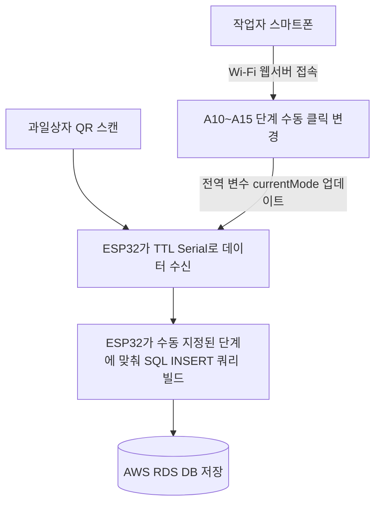
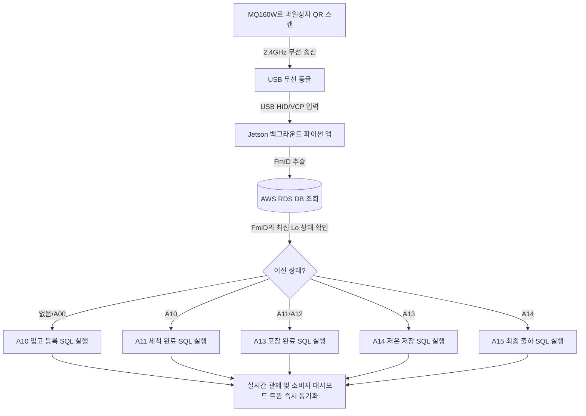

# 🔄 기존 자작 스캐너(ESP32) vs 신규 무선 관제 스캐너(Jetson+MQ160W) 비교 분석

본 문서는 기존에 활용하던 **ESP32 및 GM77 모듈 기반 자작 QR 스캐너 시제품**과 새롭게 설계한 **젯슨(Jetson) 및 MQ160W 무선 스캐너 시스템**의 하드웨어, 소프트웨어, 아키텍처적 차이점을 상세히 비교하고 그 장단점을 기록합니다.

---

## 📊 1. 종합 비교 테이블

| 비교 항목 | 기존 자작 스캐너 (ESP32 + GM77) | 신규 무선 관제 스캐너 (Jetson + MQ160W) |
| :--- | :--- | :--- |
| **하드웨어 제어 장치**| ESP32 / ESP32-S3 마이크로컨트롤러 (MCU) | Jetson Nano / Xavier / PC (SBC / 싱글보드컴퓨터) |
| **스캐너 폼팩터** | 소형 노출형 임베디드 모듈 (아크릴 또는 3D 프린터 케이스 장착) | 산업용 권총형(핸드헬드) 무선 스캐너 완제품 |
| **통신 인터페이스** | 스캐너 ↔ 보드: **유선 TTL Serial(RX/TX)** 연결 | 스캐너 ↔ 젯슨: **2.4GHz 무선 동글(USB)** 연결 |
| **스캔 단계 제어 방식**| **수동 전환 방식** - 보드 상의 물리 BOOT 버튼 클릭 - 스마트폰으로 ESP32 내부 웹 페이지에 Wi-Fi로 접속하여 "다음 단계" 버튼 수동 클릭 | **지능형 자동 추적 방식 (Method 2)** - 추가 조작 불필요 - 스캔 시 프로그램이 DB의 해당 상자 이전 이력을 조회하여 자동으로 단계를 계산하고 축적 |
| **작업 반경 및 이동성**| ESP32 보드와 스캐너가 전선으로 직결되어 스캐너 이동에 제약이 큼 | 스캐너 무선 동글을 젯슨에 꽂아둔 채, 수십 미터 반경 내에서 스캐너만 들고 자유롭게 이동 |
| **시각적 사용자 피드백**| 0.96인치 소형 OLED 디스플레이 (128x64 픽셀, 단색) | 젯슨 본체 터미널 로그, 대형 모니터 GUI 피드백 및 실시간 관제 대시보드 화면 연동 |
| **유지보수 및 코드 업로드**| PlatformIO(VS Code)를 통해 C++ 코드 컴파일 후 USB 유선 펌웨어 플래싱 (업데이트 복잡) | 리눅스 터미널에서 파이썬(Python) 파일 수정 후 즉시 실행 (원격 디버깅 및 업데이트 대단히 편리) |
| **산업 환경 내구성** | 전선 노출, 보드 보호 곤란으로 수분/충격에 매우 약함 | 방진방수 기능 및 충격 보호 설계가 기본 적용된 완제품 기기로 가혹한 세척/하역장 사용에 적합 |

---

## 🏗️ 2. 아키텍처 및 제어 흐름의 변화

### [기존] ESP32 기반의 수동 단계 제어 흐름
작업을 진행하기 위해 매번 작업자가 수동으로 단계 변수를 동기화해 주어야 했던 구조입니다.

### [신규] Jetson 및 지능형 자동 단계 판단(Method 2) 흐름
스캐너 스캔 동작 단 하나로 모든 처리가 백그라운드에서 지능적으로 이루어지는 구조입니다.

---

## 🌟 3. 신규 시스템(Jetson + MQ160W) 도입에 따른 기술적 이점

### 1) 휴먼 에러(Human Error)의 원천 차단
* **기존 자작 시스템의 한계:** 작업자가 세척 공정(`A11`)에 있으면서 스마트폰 화면의 단계를 실수로 "입고(`A10`)"로 둔 채 상자를 찍으면, 실제로는 세척된 상자인데 DB에는 중복 입고된 것으로 기록되는 등 심각한 데이터 왜곡이 발생할 수 있었습니다.
* **신규 시스템의 개선:** 작업자는 단지 눈앞의 상자 QR 코드만 찍으면 됩니다. 시스템이 DB에서 해당 박스의 고유 이력을 조회한 후 타임라인에 맞게 다음 단계로 자동 매핑하기 때문에 사람이 단계를 헷갈려 잘못 기록할 확률이 **0%**가 됩니다.

### 2) 모니터 없는 기기 운영 (Headless System)
* **기존 자작 시스템의 한계:** 모드를 확인하기 위해 항상 0.96인치 OLED 화면을 주시해야 했고, 화면 연결이 끊기거나 고장 나면 현재 통신이 잘 되는지 식별하기 어려웠습니다.
* **신규 시스템의 개선:** 젯슨은 프로그램 구동 시 터미널 혹은 시스템 서비스(Systemd)로 동작하여 모니터와 스마트폰 리모컨 화면을 완전히 치우고 전원만 연결해 두면 스캐너 작동 시 삑 소리와 함께 실시간으로 DB 이력을 제어합니다.

### 3) 높은 물리적 내구성 및 무선 편의성
* **기존 자작 시스템의 한계:** GM77 스캐너 모듈과 ESP32는 브레드보드 또는 납땜 전선들로 노출되어 있어 물기를 다루는 세척대 구역이나 과일 상자 하역장 등에서 전선 탈락이나 쇼트 고장률이 매우 높았습니다.
* **신규 시스템의 개선:** 완제품 스캐너인 MQ160W를 사용하므로 작업 중 기기를 바닥에 떨어뜨려도 고장이 나지 않으며, 먼지가 많고 습한 산지 유통 센터 내부에서도 완벽한 내구성을 보장합니다.

### 4) 파이썬 생태계 활용을 통한 기능 확장
* **기존 자작 시스템의 한계:** ESP32의 부족한 RAM 크기 및 칩셋 한계로 인해 암호화 라이브러리 구동, 실제 블록체인 노드와의 로컬 통신 연동, DB 복잡 쿼리 처리 등이 매우 어려웠습니다.
* **신규 시스템의 개선:** 젯슨은 단독 리눅스 PC이므로 파이썬의 강력한 패키지(예: `cryptography`, `pyserial`, `pymysql`, `requests` 등)를 제한 없이 활용하여, 스캔 즉시 실제 블록체인 메인넷 트랜잭션을 날리거나 로컬 무결성 파일의 2차 검증을 처리하는 구조로 손쉽게 업그레이드할 수 있습니다.
