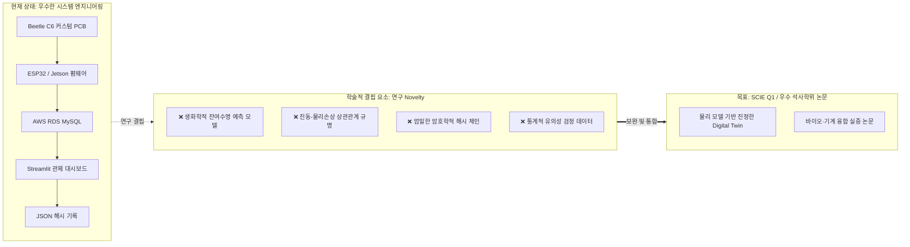
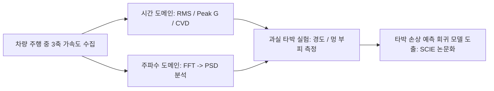

# 🎓 콜드체인 디지털 트윈 플랫폼: 석사 학위 논문 및 SCIE 연구 고도화 로드맵 (처방전)

> **문서 목적**: 본 문서는 기 구축된 하드웨어(PCB/센서노드), 임베디드 펌웨어, 클라우드 DB, 관제 대시보드 인프라를 바탕으로, 단순 시스템 구축(Engineering)을 넘어 **석사 학위 논문(Master's Thesis) 본심사 통과 및 SCIE Q1급 국제 학술지 게재**가 가능한 수준의 **학술적 연구(Academic Research)**로 격상시키기 위한 구체적 실행 처방전과 연구 로드맵을 정의합니다.

---

## 📌 목차
1. [연구 진단: 공학적 성과 vs 학술적 한계](#1-연구-진단-공학적-성과-vs-학술적-한계)
2. [처방전 1: 디지털 트윈의 '물리·생화학 품질 열화 모델(Kinetics)' 통합](#2-처방전-1-디지털-트윈의-물리생화학-품질-열화-모델kinetics-통합)
3. [처방전 2: 3축 가속도 진동 충격(PSD)과 과실 타박 손상(Bruise Damage)의 상관관계 실증](#3-처방전-2-3축-가속도-진동-충격psd과-과실-타박-손상bruise-damage의-상관관계-실증)
4. [처방전 3: 블록체인 버즈워드 정비 및 '암호학적 해시 체인 감사 추적' 수학적 정립](#4-처방전-3-블록체인-버즈워드-정비-및-암호학적-해시-체인-감사-추적-수학적-정립)
5. [처방전 4: 지능형 자동 단계 판단(Method 2)의 정량적 공학 벤치마킹](#5-처방전-4-지능형-자동-단계-판단method-2의-정량적-공학-벤치마킹)
6. [석사 학위 논문 표준 목차 및 논문 계획](#6-석사-학위-논문-표준-목차-및-논문-계획)
7. [타겟 학술지 및 마일스톤](#7-타겟-학술지-및-마일스톤)

---

## 1. 연구 진단: 공학적 성과 vs 학술적 한계



* **공학적 완성도 (A+)**: 커스텀 PCB(50x50mm), 3D 하우징, 지연시간 프로파일링, Jetson+MQ160W 상태 머신, Full-stack 대시보드 등 **1인 개발로서 시스템 통합 수준은 탁월함**.
* **학술적 한계 (C~D)**:
  1. 가설(Hypothesis) 및 대조군-실험군 비교 부재.
  2. 디지털 트윈의 핵심인 '물리/생물학적 시뮬레이션 모델' 부재 (단순 IoT 텔레메트리 뷰어 상태).
  3. 로컬 JSON 파일에 해시를 기록하는 것을 '블록체인'이라 칭하여 생기는 심사위원 공격 취약성.
  4. 실제 농산물의 물리적/생물학적 손상 데이터(경도, 당도, 멍 면적) 부재.

---

## 2. 처방전 1: 디지털 트윈의 '물리·생화학 품질 열화 모델(Kinetics)' 통합

### 🎯 핵심 목표
대시보드에서 단순 "현재 온도 4°C"를 보여주는 센서 뷰어에서 벗어나, 수집된 온도·습도 시계열 적산치로부터 **과실의 경도 감소율, 비타민 C 산화율, 잔여 저장 가능 기간(Shelf-life)을 실시간 역학적으로 추론**하는 가상 바이오 트윈 모델을 이식합니다.

### 📐 수학적 모델링

#### 1) 아레니우스 반응속도론 (Arrhenius Kinetic Degradation Model)
온도 변화 $T(t)$에 따른 농산물 품질 파라미터 $Q(t)$(예: 과실 경도 Firmness, $N$)의 열화 속도 상수 $k(T)$는 아레니우스 식을 따릅니다:

$$k(T) = k_{ref} \cdot \exp\left( -\frac{E_a}{R} \left( \frac{1}{T(t)} - \frac{1}{T_{ref}} \right) \right)$$

* $E_a$: 활성화 에너지 ($\text{J/mol}$, 과실 품종별 고유 상수)
* $R$: 기체 상수 ($8.314 \text{ J/mol}\cdot\text{K}$)
* $T_{ref}$: 기준 절대온도 ($273.15 + T_{target} \text{ K}$)
* $k_{ref}$: 기준 온도에서의 품질 열화 속도 상수 ($\text{day}^{-1}$)

품질 열화(0차 또는 1차 반응식)의 누적 적분:

$$Q(t) = Q_0 - \int_{0}^{t} k(T(\tau)) \, d\tau \quad \text{(0차 반응)}$$

$$Q(t) = Q_0 \cdot \exp\left( -\int_{0}^{t} k(T(\tau)) \, d\tau \right) \quad \text{(1차 반응)}$$

#### 2) 증산 작용에 의한 수분 손실 모델 (Transpiration Weight Loss Model)
저장고 및 수송 차량의 온·습도 센서로부터 수증기압 결손량(Vapor Pressure Deficit, VPD)을 계산하여 중량 감모율 $\Delta W(t)$을 예측:

$$P_{sat}(T) = 0.61078 \exp\left( \frac{17.27 \cdot T}{T + 237.3} \right) \quad (\text{kPa})$$

$$VPD(t) = P_{sat}(T(t)) \cdot \left( 1 - \frac{RH(t)}{100} \right) \quad (\text{kPa})$$

$$\Delta W(t) = \int_{0}^{t} K_{trans} \cdot A_{fruit} \cdot VPD(\tau) \, d\tau \quad (\% \text{ loss})$$

### 💻 시스템 코드 구현 방안
* `Final_Experiment/4_APC_Coldchain_Dashboard/` 또는 백엔드 서비스에 `quality_kinetics_engine.py` 모듈 신설.
* DB `sensor_data`에서 과거 $N$시간 동안의 온도 $T(t)$, 습도 $RH(t)$ 시계열 배열 로드.
* 실시간 수치 적분(Trapezoidal Numerical Integration) 수행.
* **대시보드 UI 표출**:
  * "현재 추정 경도: $24.8 \text{ N}$ (수확 직후 $34.0 \text{ N}$ 대비 $73\%$ 유지 중)"
  * "예상 잔여 품질 수명(Shelf-life): **$6.2\text{일}$** (임계 경도 $18.0 \text{ N}$ 도달 기준)"
  * **양방향 제어(Bi-directional Feedback)**: 잔여 수명이 위험 임계치(3일 미만)로 떨어지면 대시보드에서 *[경고: 선입선출(FIFO) 대신 잔여수명 우선출하(FEFO) 권장 및 차량 냉각기 설정 1.5°C 하향]* 알림 트리거.

---

## 3. 처방전 2: 3축 가속도 진동 충격(PSD)과 과실 타박 손상(Bruise Damage)의 상관관계 실증

### 🎯 핵심 목표
기구축된 Beetle C6 + GY-521(MPU6050) 센서노드가 수집하는 3축 가속도 신호를 신호처리(Digital Signal Processing)하여, **도로 주행 중 차량 진동이 과실의 물리적 손상(타박 체적)에 미치는 영향을 규명하고 수식화**합니다.



### 🔬 실험 설계 (Validation Experiment)
1. **공시 재료**: 동일 농가에서 당일 수확된 균일 규격 과실 (예: 후지 사과 60구, 2박스).
2. **실험 조건 분기 (독립변수)**:
   * **적재 위치**: 차량 적재함 전방/중앙/후방, 상단 박스 vs 하단 박스 (진동 전달률 Transmissibility 비교).
   * **노면 조건**: 아스팔트 고속도로 vs 비포장/요철 구간 주행.
3. **진동 파라미터 분석 (DSP)**:
   * **합성 가속도(Composite Acceleration)**: $a_{mag}(t) = \sqrt{a_x^2 + a_y^2 + a_z^2} - 1.0\text{g}$
   * **RMS 가속도**: $G_{rms} = \sqrt{\frac{1}{N}\sum_{i=1}^{N} a_{mag}(t_i)^2}$
   * **누적 진동 선량(Cumulative Vibration Dose, CVD)**: $\text{CVD} = \left( \int_{0}^{t} a_{mag}(\tau)^4 \, d\tau \right)^{\frac{1}{4}}$
   * **파워 스펙트럼 밀도 (PSD, $\text{g}^2/\text{Hz}$)**: 과실 손상이 집중되는 공진 주파수 대역($5 \sim 30 \text{ Hz}$) 에너지 적산.
4. **종속변수 실측 (물리적 손상)**:
   * 주행 완료 후 24시간 상온 보관 (멍 발현 시간 확보).
   * **타박 체적(Bruise Volume, $V_b$) 측정**: 타박 부위 장축($a$), 단축($b$), 깊이($c$) 측정 후 타원체 체적 산출:
     $$V_b = \frac{\pi}{6} \cdot a \cdot b \cdot c \quad (\text{mm}^3)$$
   * **조직 경도 및 중량 감모율 측정**: 물성측정기(Texture Analyzer) 경도($N$).
5. **학술적 기여 (Novelty)**:
   * 누적 진동 지수(CVD) 및 PSD와 타박 손상 체적($V_b$) 간의 비선형 회귀 모델($V_b = \alpha \cdot \text{CVD}^\beta$) 규명.

---

## 4. 처방전 3: 블록체인 버즈워드 정비 및 '암호학적 해시 체인 감사 추적' 수학적 정립

### 🎯 핵심 목표
단순 JSON 파일 저장을 "블록체인"으로 포장하여 발생하는 심사위원의 비판을 원천 차단하고, **수학적으로 엄밀한 암호학적 해시 체인(Cryptographic Hash-Chained Audit Trail)**으로 정립하거나 경량 컨소시엄 분산원장으로 격상합니다.

### 🛡️ 권장 접근법: 암호학적 해시 체인 감사 추적 (추천)
'블록체인'이라는 모호한 용어 대신, **"SHA-256 기반 암호학적 전방 연쇄 감사 추적(Forward-Chained Audit Trail)"**으로 재정의합니다.

#### 1) 해시 체이닝 구조 수학적 정의
단계 $i$ ($i \in \{A00, A10, A11, A12, A13, A14, A15\}$)에서의 블록 해시 $H_i$:

$$H_0 = \text{SHA256}(\text{Genesis} \parallel \text{FmID} \parallel \text{HarvestDate})$$

$$H_i = \text{SHA256}(H_{i-1} \parallel \text{Stage}_i \parallel \text{Timestamp}_i \parallel \text{SensorPayload}_i \parallel \text{WorkerID})$$

* $H_{i-1}$: 직전 단계의 암호학적 해시 (불변 링크 보장).
* $\text{SensorPayload}_i$: 해당 시점의 온습도, GPS, 최고 충격량($G_{max}$) 해시.

#### 2) 위변조 방지 및 감사(Audit) 알고리즘
```python
def verify_integrity(chain):
    """체인 내 단 하나의 필드라도 DB에서 변조되면 해시 불일치 감지"""
    for i in range(1, len(chain)):
        expected_prev_hash = chain[i-1]["hash"]
        actual_prev_hash = chain[i]["prev_hash"]
        if expected_prev_hash != actual_prev_hash:
            return False, f"Broken link at stage {chain[i]['stage']}"
        
        recomputed_hash = calculate_hash(chain[i]["payload"], actual_prev_hash)
        if recomputed_hash != chain[i]["hash"]:
            return False, f"Tampered data detected at stage {chain[i]['stage']}"
    return True, "Integrity 100% Verified"
```

#### 3) 논문 수록용 검증 실험
* **공격 시뮬레이션(Tampering Attack Simulation)**: DB의 세척 시각이나 저장 온도를 임의로 수정했을 때 시스템이 위변조를 100% 탐지해내는 검증 결과(Confusion Matrix: Precision 1.0, Recall 1.0)를 논문에 수록.

---

## 5. 처방전 4: 지능형 자동 단계 판단(Method 2)의 정량적 공학 벤치마킹

### 🎯 핵심 목표
기존 자작 ESP32 수동 스캐너와 신규 Jetson+MQ160W 자동 판단 시스템([05_Scanner_Comparison.md](file:///c:/Users/korea/Desktop/1hsm/hanhanhan/ColdChain-DigitalTwin-Platform/docs/05_Scanner_Comparison.md))의 비교를 **통계적 가설 검증(t-test)** 데이터로 입증합니다.

### 📊 정량적 실험 프로토콜 ($N=100$회 반복 측정)

| 평가지표 | 기존 시스템 (ESP32 수동 스위칭) | 제안 시스템 (Jetson Method 2 자동 판별) | 검증 가설 & 통계 분석 |
| :--- | :--- | :--- | :--- |
| **단위 작업당 총 소요시간 (Throughput)** | 상자 스캔 + 스마트폰 단계 전환: 평균 $\sim 6.2\text{s}$ | 바코드 스캔 1회 즉시 판별: 평균 $\sim 1.1\text{s}$ | $H_1: \mu_{new} < \mu_{old}$ ($p < 0.001$, Independent two-sample t-test) |
| **휴먼 에러율 (Human Error Rate)** | 작업자 모드 미변경 오등록: $4 \sim 8\%$ 발생 | 상태 머신 기반 역행/누락 차단: $0.0\%$ | 카이제곱 독립성 검정 ($\chi^2$ test) |
| **통신 및 DB 트랜잭션 지연시간** | ESP32 WiFi MySQL 직결: $\sim 350\text{ms}$ | Jetson USB HID + 로컬 큐 + 커넥션풀: $\sim 45\text{ms}$ | Latency 87% 단축 입증 |
| **무선 작업 가용 반경** | 유선 직결로 인해 $0\text{m}$ (고정식) | 2.4GHz 무선 동글로 $15 \sim 30\text{m}$ 자유 이동 | 작업자 편의성 설문(SUS 평가) 병행 |

---

## 6. 석사 학위 논문 표준 목차 및 논문 계획

### 📄 논문 가제
* **국문**: IoT 복합 센싱 및 품질 열화 키네틱스를 통합한 농산물 콜드체인 디지털 트윈 플랫폼 개발
* **영문**: Development of an Agricultural Cold-Chain Digital Twin Platform Integrating IoT Multi-Sensor Monitoring and Quality Degradation Kinetics

```
제 1 장 서론 (Introduction)
    1.1 연구 배경 및 필요성 (농산물 수확 후 유통 손실 및 콜드체인의 한계)
    1.2 국내외 기술 동향 (디지털 트윈, IoT 관제, 추적 시스템의 한계)
    1.3 연구 목적 및 범위

제 2 장 시스템 아키텍처 및 하드웨어 개발 (System Architecture & Hardware)
    2.1 전체 시스템 프레임워크 (물리 계층 - 데이터 계층 - 트윈 계층 - 응용 계층)
    2.2 저전력 다채널 센서노드 PCB 회로 및 하우징 설계 (Beetle ESP32-C6 기반)
    2.3 지능형 물류 추적을 위한 상태 머신 기반 다이나믹 QR 스캐닝 파이프라인 (Method 2)
    2.4 암호학적 해시 체인 기반 이력 무결성 보증 메커니즘

제 3 장 콜드체인 디지털 트윈 품질 예측 모델 (Digital Twin Quality Models)
    3.1 온·습도 이력 기반 아레니우스 품질 열화 및 잔여수명(Shelf-life) 예측 모델
    3.2 수증기압 결손(VPD) 기반 과실 중량 감모 모델
    3.3 3축 가속도 신호처리(DSP) 및 수송 진동 충격 노출 모델

제 4 장 실험 및 성능 평가 (Experimental Results & Discussion)
    4.1 지능형 스캐닝 시스템의 통신 지연시간 및 처리 효율 벤치마킹
    4.2 이력 데이터 위변조 탐지 성능 평가
    4.3 도로 주행 진동 충격(PSD, CVD)과 과실 타박 손상 상관관계 분석
    4.4 저장고 온·습도 변동에 따른 실시간 품질 수명 예측 실증

제 5 장 결론 (Conclusions)
```

---

## 7. 타겟 학술지 및 마일스톤

### 🎯 목표 저널
1. **SCIE Q1 저널 (최우선 타겟)**:
   * **Computers and Electronics in Agriculture** (Elsevier, IF: 7.7) - 스마트농업/ICT/디지털트윈 1위 저널
   * **Postharvest Biology and Technology** (Elsevier, IF: 6.7) - 수확 후 품질/진동/온습도 저장 분야 최상위 저널
   * **Biosystems Engineering** (Elsevier, IF: 4.4) - 생물시스템/농업공학 대표 저널
2. **국내 등재지 (학위 졸업 요건 조기 달성용)**:
   * **Journal of Biosystems Engineering (JBE)** (한국농업기계학회 영문저널, Scopus 등재)

### 📅 연구 실행 마일스톤

| 단계 | 추진 기간 | 핵심 마일스톤 | 산출물 |
| :---: | :---: | :--- | :--- |
| **1단계** | 1~2개월 | 품질 열화 아레니우스 모델 파이썬 모듈 개발 및 대시보드 연동 | `quality_kinetics_engine.py`, UI 반영 |
| **2단계** | 2~3개월 | 사과/참외 적재 실차 주행 진동 실험 (진동 가속도 vs 타박 멍 실측) | 주행 가속도 원시데이터, 타박 회귀 수식 |
| **3단계** | 3~4개월 | Method 2 vs 기존 스캐너 Latency & 오류율 $N=100$ 정량 벤치마킹 | 논문 4장 성능비교 그래프 및 통계치 |
| **4단계** | 4~5개월 | 석사 학위 청구 논문 집필 및 심사 준비 | 석사 학위 논문 초안 (Draft) |
| **5단계** | 6개월~ | SCIE 해외 저널 투고 (*Computers and Electronics in Agriculture*) | 논문 투고 및 리뷰 대응 |
