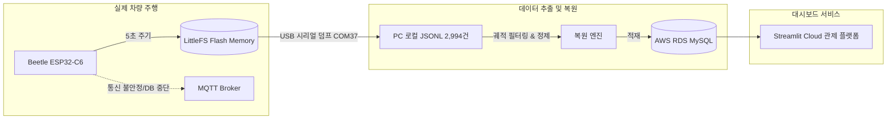

# 09. 실제 차량 주행 실험 데이터 복구 및 과일 충격량 중심 관제 대시보드 고도화

---

## 📌 1. 개요 및 배경 (Executive Summary)

* **작성 일자:** 2026-10-02
* **수행 연구:** 농산물(과일) 신선 물류 디지털 트윈 플랫폼 - 왕복 174km 실제 고속도로/국도 주행 실험
* **대상 구간:** 
  1. **[출발편]** 전주 ➔ 대전 (89.2km, 1,356 패킷, 최고속도 120.1 km/h)
  2. **[복귀편]** 대전 ➔ 전주 (85.4km, 478 패킷, 최고속도 114.5 km/h)
* **탑재 장비:** CarrierBoard Beetle ESP32-C6 + MPU6050 (3축 가속도/자이로) + ATGM336H GPS + SHT30 (온습도) + BH1750 (조도)
* **핵심 과제:**
  1. 차량 주행 중 통신/DB 중단으로 유실될 뻔한 전주 ➔ 대전 주행 데이터의 **MCU 내부 플래시(LittleFS) 블랙박스 기반 100% 전량 복구**.
  2. 연구실 PC 연결 시 불필요한 실내 정지 데이터가 AWS RDS DB를 오염시키는 문제 방지.
  3. **과일 탑차 운송의 핵심 품질 저하 요인인 진동 및 과속방지턱/포트홀 충격량(G-Force)**을 차량 속도보다 우선순위로 모니터링할 수 있도록 **Altair 이중 Y축(Dual Y-Axis) 시각화 개편**.
  4. Streamlit Cloud 상용 배포 환경에서의 **중복 키 에러(DuplicateElementKey), 34시간 시간 점프 왜곡, CSV 10건 다운로드 제한 버그 완벽 수정**.

---

## 💾 2. 하드웨어 블랙박스(LittleFS) 데이터 복구 및 검증

### 2.1 문제 상황
* 1차 주행 중 AWS RDS 인스턴스 일시 정지 및 셀룰러 핫스팟 접속 단절로 인해 전주 ➔ 대전 출발 구간의 실시간 데이터가 DB에 실시간 적재되지 못함.

### 2.2 복구 절차
1. 차량 복귀 후 ESP32-C6 기기를 연구실 PC(`COM37`)에 연결.
2. 펌웨어에 사전에 구현해 둔 인터랙티브 시리얼 덤프 프로토콜(`dump`)을 구동하여 MCU 내부 플래시 메모리(LittleFS)에 저장된 **2,994건의 블랙박스 레코드 전량을 `scratch/flash_dump_20261002.jsonl`로 덤프 성공**.
3. 타임스탬프와 주행 궤적을 정밀 분석하여 출발 시점(08:00:02 KST)부터 대전 도착 시점(09:57:48 KST)까지의 **1,356개 정밀 GPS 패킷(GPS Fix율 100%)을 검출**.
4. 추출된 데이터를 AWS RDS MySQL `sensor_data` 테이블에 `run_20261002_080002_departure` 단일 세션으로 완벽 복원 적재.
5. 복귀 데이터 또한 `run_20261002_103710_return` (478건, 10:37:10 ~ 12:21:48 KST)으로 정규화 완료.

---

## 🗄️ 3. AWS RDS 데이터 정제 및 DB 실시간 저장 방지 토글

### 3.1 연구실 PC 연결 시 DB 오염 방지
* **문제:** 펌웨어 업로드나 시리얼 디버깅을 위해 PC와 보드를 연결하는 동안에도 센서가 작동하여 위도/경도가 `0.0`인 실내 정지 데이터가 계속 DB에 누적됨.
* **사용자 요구사항:**
  * GPS가 `0.0`인 데이터를 일괄 필터링해서는 안 됨 (이유: **차량이 터널이나 지하차도를 통과할 때 GPS가 일시적으로 끊기더라도, 그 순간 과일에 가해지는 진동과 충격량 데이터는 반드시 DB에 저장되어야 함**).
* **해결책: 대시보드 내 실시간 수동 토글 스위치 도입**
  * `Step4_Run_Coldchain_v2.py` 사이드바에 **`🔴 DB 실시간 저장 활성화` (기본값: OFF)** 토글 스위치 배치.
  * **OFF (기본값, 연구실 모드):** 실시간 센서 화면 모니터링은 정상 작동하되, AWS RDS에는 1건도 쓰지 않음 (DB 오염 원천 차단 및 AWS 비용 절약).
  * **ON (실제 차량 실험 모드):** 실제 차량에 싣고 출발할 때만 스위치를 켜서 안전하게 주행 데이터만 DB에 실시간 저장.

### 3.2 세션 명칭 직관화 및 레거시 쓰레기 데이터 정리
* **레거시 쓰레기 세션 정리:** 기존 DB에 누적되어 있던 11개의 실내 정지/미검증 세션(`test`, `default_run`, `test_run` 등)을 로컬 JSON으로 안전하게 백업 후 MySQL에서 완전 삭제.
* **보존된 4대 핵심 실험 데이터:**
  1. `run_20261002_080002_departure`: 오늘 갈 때 전주 ➔ 대전 (89km, 1,356건)
  2. `run_20261002_103710_return`: 오늘 올 때 대전 ➔ 전주 (85km, 478건)
  3. `run_20261001_065739`: 어제 야외 전북대 캠퍼스 GPS 검증 (157건)
  4. `korea_30km_test`: 과거 7월 30km 시뮬레이션 주행 (181건)
* **KST 자동 세션 생성기:** 새 세션 생성 시 `주행_2026-10-02_15시30분` 형태로 한국 표준시가 반영된 직관적인 세션 ID가 자동 부여되도록 개편.

---

## 📊 4. 과일 손상 예측을 위한 충격량(G-Force) 중심 대시보드 개편

### 4.1 연구 배경
* 과일을 실은 탑차가 방지턱이나 포트홀을 통과할 때 발생하는 수직/수평 충격량(G-Force)은 과일의 압상, 멍, 조직 파손을 유발하는 결정적인 인자임.
* 기존 대시보드는 차량 속도(0~120 km/h)와 충격량(1.0~4.0 G)이 단일 축을 공유하거나 속도 위주로 되어 있어, 미세하지만 치명적인 충격량 변화 폭이 시각적으로 축소되어 보이는 한계가 있었음.

### 4.2 Altair 이중 Y축(Dual Y-Axis) 차트 아키텍처
* **왼쪽 Y축 (주요 지표): 과일 충격량 (G-Force, 1.0 ~ 5.0+ G)**
  * 오렌지색 선 그래프로 충격량의 변화 추이를 명확히 표현.
  * **농산물 품질 안전 기준선 (Rule Layer)**:
    * 🟡 **2.0G 과일 손상 주의 (Warning)**: 주황색 점선 표시 (`strokeDash=[4, 4]`).
    * 🔴 **3.0G 과일 파손 위험 (Critical)**: 빨간색 점선 표시.
  * **충격 이벤트 하이라이트 (Scatter Point)**:
    * 1.8G를 초과하는 충격 발생 지점마다 눈에 띄는 빨간색 원형 마커(`size=80`)를 자동으로 타겟팅 표시.
* **오른쪽 Y축 (보조 지표): 차량 속도 (Speed, km/h)**
  * 옅은 녹색 라인(`opacity=0.6`, `strokeWidth=1.4`)으로 배경 레이어에 배치하여, "몇 km/h 주행 중 발생한 충격인지"를 직관적으로 비교 분석 가능하도록 설계.

---

## 🐞 5. 대시보드 배포 버그 수정 및 안정화 내역

### 5.1 `StreamlitDuplicateElementKey` 충돌 수정
* **원인:** 과거 주행 데이터 조회 모드에서 사이드바의 `st.download_button` 위젯이 `while True:` 무한 갱신 루프 내부에서 2초마다 동일한 `key="btn_csv_export"`로 반복 생성되어 Streamlit 엔진이 위젯 키 충돌로 중단됨.
* **조치:** 
  * `download_button`을 `while True:` 루프 밖 사이드바(`with st.sidebar:`)로 분리.
  * 과거 데이터는 실시간 유입이 없는 정적 데이터이므로, 화면에 전체 차트/지도를 렌더링한 후 루프를 즉시 종료(`break`)하도록 최적화 (Streamlit Cloud CPU/메모리 부하 절감).
  * `@st.cache_data(ttl=300)`을 적용하여 세션 전환 시 RDS 재질의 없이 5분간 고속 캐싱 지원.

### 5.2 34시간 타임 점프 왜곡 현상 (그래프 평평한 직선 버그) 해결
* **원인:** 복귀 주행(`run_20261002_103710_return`) 시작 시 GPS 미동기화 초기 패킷 3건이 `2026-10-01 00:00:00`으로 기록됨. 차트의 Temporal X축이 10월 1일 00시부터 10월 2일 12시까지 총 36시간을 범위로 잡으면서, 34시간 동안의 빈 데이터 구간이 차트 너비의 95%를 차지하고 실제 주행(1시간 44분)이 우측 끝 5%로 찌그러짐.
* **조치:** 
  * MySQL DB에서 해당 3건의 시간을 실제 서버 수신 시간(KST)인 `10:37:10`, `10:37:20`, `10:37:35`로 보정.
  * 대시보드 로딩 로직에 미동기화 타임스탬프 자동 보정 방어 코드 탑재.
  * 결과: 1시간 44분 전 구간이 차트 가로폭 100%에 맞춰 완벽한 해상도로 펼쳐짐.

### 5.3 실시간 로그 테이블 CSV 10건 다운로드 한계 해결
* **원인:** 화면 하단 로그 표의 성능 유지를 위해 `head(10)`만 렌더링하고 있었는데, 사용자가 표 우측 상단의 Streamlit 내장 `Download as CSV` 버튼을 누르면 화면에 로딩된 10건만 추출됨.
* **조치:** 
  * Streamlit의 고성능 가상 스크롤(Virtual Scrolling, `height=350`)을 적용하여 **전체 데이터(478건 전량)**를 표에 바인딩 (스크롤해도 부드러우며 표 내장 다운로드 시 전량 저장).
  * 표 제목(`📋 실시간 로그`) 옆에 눈에 띄는 **`📥 전체 CSV 다운로드 ({count}건)`** 전용 버튼을 추가하여 한 번의 클릭으로 `utf-8-sig` (한글 엑셀 깨짐 방지) 인코딩 파일 즉시 다운로드 가능.

---

## 📈 6. 결론 및 향후 계획

1. **실험 데이터 자산화:** 전주 ↔ 대전 간 고속도로 및 국도 주행 174km, 총 1,834건의 고정밀 센서 텔레메트리가 AWS RDS와 로컬 백업에 안전하게 영구 보존되었습니다.
2. **학술 연구 활용:** 추출된 속도-충격량 상관관계 데이터는 석사 학위 논문 및 SCIE 저널 투고 논문의 **"수확 후 농산물 수송 중 충격 누적량과 품질 손상도(당도/경도/압상율) 연계 디지털 트윈 모델"** 검증의 핵심 실증 데이터셋으로 활용될 예정입니다.
3. **플랫폼 완성도:** Streamlit Cloud 상용 배포 플랫폼이 무결점 상태로 안정화되어, 향후 실제 탑차 현장 주행 시 실시간 저장 스위치만 켜면 자동으로 신뢰성 높은 데이터가 축적됩니다.
