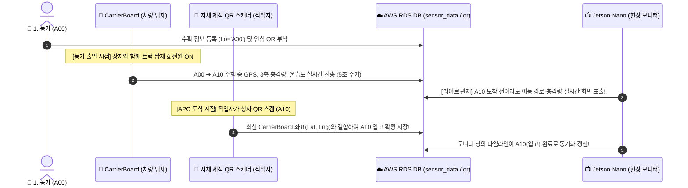

# 11. 젯슨 나노 현장 관제 키오스크 설정 및 콜드체인 실증 프로토콜

> **문서 목적**: 본 문서는 실제 농가-산지유통센터(APC) 현장 및 차량 주행 실험 시, 스마트폰이나 노트북 조작 없이 **Jetson Nano와 외장 모니터**를 통해 실시간으로 센서 텔레메트리와 유통 이력을 관제할 수 있는 **스탠드얼론 키오스크(Kiosk) 구축 가이드**와 **하드웨어별(CarrierBoard / 자작 스캐너) 역할 및 데이터 연동 프로토콜**을 체계적으로 정리합니다.

---

## 📌 1. 전체 실험 파이프라인 및 하드웨어 역할 분담

본 플랫폼은 농가 수확(`A00`)부터 APC 처리(`A10`~`A14`), 최종 출하(`A15`)에 이르기까지 **3대 하드웨어 시스템**이 유기적으로 데이터를 상호 연동합니다.



### 3대 하드웨어의 명확한 역할 정의
1. **작업자 휴대 장비: [자체 제작 QR 스캐너](file:///c:/Users/korea/Desktop/1hsm/hanhanhan/ColdChain-DigitalTwin-Platform/Final_Experiment/2_ESP32_Firmware/src/main.cpp)**
   * **구성:** ESP32 + GM77 바코드 엔진 + 0.96인치 OLED + 택트 스위치
   * **역할:** 작업자가 상자 QR을 스캔하면 ESP32가 자체 Wi-Fi를 통해 AWS RDS `qr` 테이블에 직접 SQL INSERT 수행.
2. **차량 탑재 장비: [CarrierBoard 센서노드](file:///c:/Users/korea/Desktop/1hsm/hanhanhan/ColdChain-DigitalTwin-Platform/docs/07_CarrierBoard_Assembly_and_Diagnostic_Log.md)**
   * **구성:** DFRobot Beetle ESP32-C6 + MPU6050 + ATGM336H GPS + SHT30/45 + BH1750
   * **역할:** A00(농가) 상차 시점부터 A10(APC) 도착, 그리고 A15(최종 출하) 배송까지 차량의 이동 궤적, 속도, 과일 충격량(G-Force), 온·습도를 5초마다 실시간 MQTT 송출 및 내부 플래시(LittleFS) 블랙박스 영구 기록.
3. **현장/차량 관제소: [Jetson Nano + 모니터]**
   * **구성:** Jetson Nano (또는 Orin Nano) + HDMI 소형/대형 모니터
   * **역할:** 스마트폰 조작 없이 상시 켜져 있는 현장용 전체화면(Kiosk) 디스플레이. A00 출발 직후부터 차량 실시간 위치 지도, 충격 그래프, 상자 유통 이력을 원스톱 라이브 표출.

---

## 🔍 2. A00 ➔ A10 연동의 핵심 원리

### Q. "젯슨 나노에서는 A00부터 볼 수 없나요?"
* **A. 아닙니다! A00 출발 순간부터 라이브로 모두 볼 수 있습니다.**
  1. **농가 수확 정보 (`A00`)**: 농가에서 QR을 생성하는 순간(`Step1_Farm_QR_Creator.py`) 이미 AWS RDS DB에 `Lo='A00'`으로 저장되므로, 젯슨나노 화면에서 즉시 조회 가능합니다.
  2. **농가 ➔ APC 이동 중 (`A00 ➔ A10`)**: 트럭에 CarrierBoard를 싣고 출발하면 스마트 주행 감지 래치(`trip_active`)가 켜져 실시간 데이터를 전송하므로, **A10(APC)에 도착하기 전이라도 트럭의 실시간 위치와 충격량이 젯슨나노 모니터에 라이브로 표출**됩니다.
  3. **APC 도착 후 A10 스캔**: A10 스캔은 "모니터 화면을 처음 켜는 트리거"가 아니라, **"지금까지 실시간으로 수집된 운송 데이터와 상자 정보를 입고(A10) 확정 이력으로 결합하여 도장을 찍는 체크포인트"**입니다.

---

## 🚀 3. Jetson Nano 현장 관제 키오스크 상세 설정 가이드

### 3.1 소프트웨어 환경 설정 (터미널 작업)

Jetson Nano(Ubuntu) 터미널을 열고 순서대로 실행합니다:

```bash
# 1. 시스템 업데이트 및 전체화면용 Chromium 브라우저 설치
sudo apt update
sudo apt install -y chromium-browser

# 2. 프로젝트 리포지토리 폴더로 이동
cd ~/ColdChain-DigitalTwin-Platform

# 3. 필수 파이썬 라이브러리 설치
pip3 install streamlit pymysql paho-mqtt altair pandas folium streamlit-folium
```

---

### 3.2 수동 실행 및 테스트

#### 1) Streamlit 대시보드 백그라운드 구동 (젯슨 전용 스플릿 HUD 대시보드)
```bash
streamlit run Final_Experiment/4_APC_Coldchain_Dashboard/Step4_Jetson_SplitHUD.py \
  --server.port 8501 \
  --server.headless true \
  --browser.serverAddress localhost &
```

#### 2) 우분투 순정 브라우저(Epiphany) 실행
*(※ Snap 패키지 호환 문제가 없는 우분투 공식 Epiphany 브라우저 사용 권장)*
```bash
DISPLAY=:1 XAUTHORITY=/home/$USER/.Xauthority epiphany-browser http://localhost:8501 &
```
*(화면 번호가 `:0`인 경우 `DISPLAY=:0` 입력, `-a` 옵션 없이 URL 직접 입력)*
> **키오스크 조작 팁**:
> * 종료: 키보드의 `Alt + F4` 또는 터미널에서 `killall epiphany-browser`
> * 새로고침: `F5` 또는 `Ctrl + R`
> * **세션 선택 기능**: 상단 드롭다운에서 `🟢 실시간 주행` 및 과거 주행 기록(전주➔대전 등)을 자유롭게 전환하여 열람 가능하며, 과거 기록을 보는 중에도 우측 배지에 차량의 실시간 온·습도·충격 수치가 상시 표시됩니다.

---

### 3.3 차량 시동/부팅 시 자동 실행(Autostart) 스크립트 구축

실제 차량이나 현장에서는 전원만 켜면 모니터에 관제 화면이 자동으로 뜨도록 설정하는 것이 가장 이상적입니다.

#### 1) 쉘 스크립트 작성 (`run_kiosk.sh`)
```bash
nano ~/run_kiosk.sh
```
아래 내용을 입력하고 저장(`Ctrl + O` ➔ `Enter` ➔ `Ctrl + X`):

```bash
#!/bin/bash
# 1. 네트워크 및 GUI 데스크톱 초기화 대기 (10초)
sleep 10

# 2. 프로젝트 경로로 이동 (사용자 계정명 확인)
cd /home/$USER/ColdChain-DigitalTwin-Platform

# 3. Streamlit 대시보드 백그라운드 구동
streamlit run Final_Experiment/4_APC_Coldchain_Dashboard/Step4_Run_Coldchain_v2.py \
  --server.port 8501 \
  --server.headless true \
  --browser.serverAddress localhost &

# 4. Streamlit 웹서버 기동 대기 (5초)
sleep 5

# 5. 크로미움 브라우저 전체화면 키오스크 모드로 오픈
chromium-browser --kiosk --noerrdialogs --disable-infobars http://localhost:8501
```

#### 2) 스크립트 실행 권한 부여
```bash
chmod +x ~/run_kiosk.sh
```

#### 3) Ubuntu GUI 시작 프로그램(Startup Applications) 등록
1. Jetson 데스크톱 검색창에서 **`Startup Applications`** 검색 및 실행
2. **Add (추가)** 버튼 클릭:
   * **Name**: `ColdChain Dashboard Kiosk`
   * **Command**: `/home/사용자명/run_kiosk.sh` (본인 Ubuntu 계정명)
   * **Comment**: `Auto-run coldchain kiosk dashboard on boot`
3. **Save (저장)** 클릭

---

## 💡 4. 현장 실험 운용 핵심 체크리스트

| 점검 항목 | 설정 권장값 | 이유 |
| :--- | :--- | :--- |
| **네트워크 핫스팟** | SSID: `hani` / 2.4GHz | CarrierBoard와 Jetson Nano가 동일 AP에 연결되어야 로컬/브로커 실시간 통신 원활 |
| **Jetson 전원 공급** | 시가잭 12V ➔ 5V 4A 강압 모듈 or 고용량 USB-PD | 전력 부족 시 CPU/GPU 쓰로틀링 및 브라우저 다운 현상 예방 |
| **모니터 절전 방지** | Settings ➔ Power ➔ `Screen Blank: Never` | 주행 중 모니터가 절전 모드로 꺼지는 현상 방지 |
| **현장 스캔 연동** | 자체 제작 QR 스캐너 휴대 | 현장에서 박스 스캔 즉시 젯슨 모니터에 0.1초 만에 반영 |
