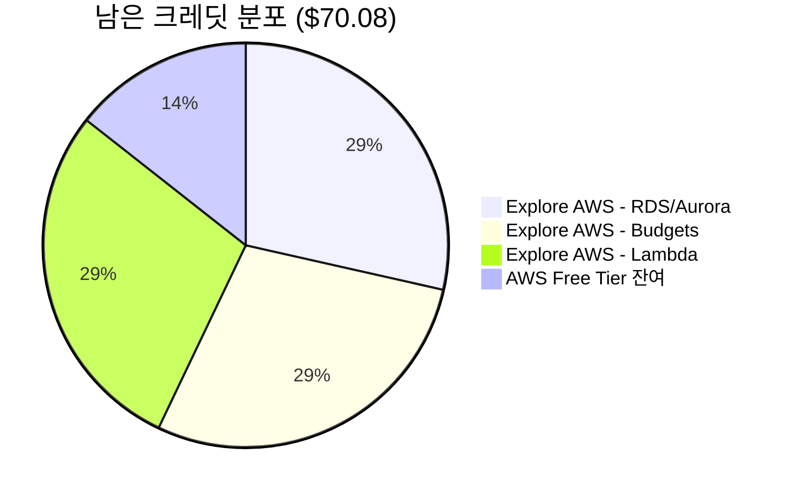
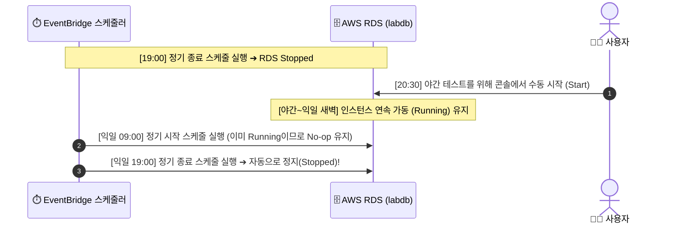

# 12. AWS RDS 클라우드 인프라 비용 분석 및 운영 관리 가이드

> **문서 목적**: 본 문서는 본 콜드체인 디지털 트윈 플랫폼의 클라우드 백엔드로 사용 중인 **AWS RDS(MySQL) 인스턴스의 비용 구조, 잔여 크레딧 현황, 운영 스케줄(예약 가동/종료) 동작 메커니즘, 그리고 예산 알림(AWS Budgets) 관리 가이드**를 체계적으로 정리합니다.

---

## 📌 1. AWS RDS 인스턴스 사양 및 단가 분석

본 연구실 플랫폼에서 센서 텔레메트리(`sensor_data`) 및 유통 이력(`qr`)을 관리하는 데이터베이스 사양입니다.

* **엔드포인트:** `labdb.cn26yq6q0mu6.ap-northeast-2.rds.amazonaws.com:3306`
* **리전:** 아시아 태평양 (서울) `ap-northeast-2`
* **엔진 버전:** MySQL 8.4.8 (AWS Managed RDS)
* **인스턴스 클래스:** `db.t3.micro` (1 vCPU, 1 GiB RAM, 버퍼풀 약 384MB)
* **스토리지:** 20 GiB (General Purpose SSD - gp2/gp3)

### 서울 리전 정격 단가 (Single-AZ 기준)
1. **컴퓨팅 인스턴스:** **시간당 $0.026** (약 35원/시간)
2. **EBS 스토리지 (20GB):** **월 약 $2.60** (인스턴스를 중지해도 데이터 보존을 위해 스토리지는 과금됨)

---

## 💳 2. 활성 크레딧 현황 및 차감 구조 (2026년 10월 기준)

현재 총 4개의 프로모션/온보딩 크레딧이 계정에 활성화되어 있습니다.

* **남은 총 크레딧:** **US$70.08** (약 95,000원 상당)
* **크레딧 만료일:** **2027년 4월 27일** (유효기간 넉넉함)
* **주요 크레딧 세부 내역:**
  1. `10060090827` (Explore AWS: Create an Aurora or RDS database): **$20.00 잔여 (RDS 전용, 0원 사용)**
  2. `10061592420` (Explore AWS: Set up a cost budget): **$20.00 잔여**
  3. `10061597460` (Explore AWS: Create a web app using Lambda): **$20.00 잔여**
  4. `10060090724` (AWS Free Tier / 온보딩): **$10.08 잔여** ($89.92 소진)

> 💡 **비용 차감 원리**: 발생하는 모든 요금은 신용카드가 아니라 **위 활성 크레딧에서 1순위로 자동 차감**되므로 현재 실질적인 본인 지출액은 **0원**입니다.

---

## 📊 3. 운영 모드별 월간 예상 비용 비교

사용자의 운영 방식(스케줄 예약 vs 24시간 상시 가동)에 따른 비용 산출표입니다.

| 운영 모드 | 일일 가동 시간 | 월간 컴퓨팅 비용 | 월간 스토리지 비용 | 월 총 예상 요금 | 크레딧($70.08) 소진 기간 |
| :--- | :---: | :---: | :---: | :---: | :---: |
| **현재: 예약 가동 (09:00~19:00)** | 10시간 (월 300h) | $7.80 | $2.60 | **약 $10.40 / 월 (약 1.4만 원)** | **약 6.7개월 무료 유지** |
| **변경: 24시간 365일 풀가동** | 24시간 (월 730h) | $18.98 | $2.60 | **약 $21.58 / 월 (약 2.9만 원)** | **약 3.2개월 무료 유지** |
| **휴식기: 인스턴스 중지 (Stopped)**| 0시간 (월 0h) | $0.00 | $2.60 | **약 $2.60 / 월 (약 3,500원)** | **약 27개월 무료 유지** |

---

## ⏰ 4. 예약 스케줄과 야간 수동 기동 시 라이프사이클

현재 인스턴스는 매일 **오전 9시 기동 ➔ 저녁 7시 종료** 자동 스케줄이 설정되어 있습니다.

### 핵심 동작 원리
1. **야간 수동 시작 시**: 저녁 7시 정기 종료 트리거는 이미 통과했으므로, **수동으로 켠 순간부터 오늘 밤새 계속 켜진 상태(Running)로 유지**됩니다.
2. **익일 아침 9시**: '시작' 스케줄이 호출되나 이미 켜져 있으므로 정상 가동 상태를 이어갑니다.
3. **익일 저녁 7시**: 설정된 **'종료(Stop)' 스케줄이 정상적으로 트리거되어 다시 자동으로 꺼집니다.**
4. **비용 영향**: 밤새 10시간 추가 가동 시 발생하는 비용은 약 **0.26달러(약 350원)**이며 전액 크레딧에서 차감되므로 지출은 0원입니다.

---

## 🛡️ 5. 예산 알림(AWS Budgets) 설정 및 주의사항

기습 결제를 방지하기 위해 생성된 **`My Zero-Spend Budget`**의 설정 가이드입니다.

### 5.1 알림 vs 차단의 차이
* **AWS Budgets는 자동 차단기가 아닙니다.**
* $0.01(약 13원)을 초과하더라도 **서버가 자동으로 꺼지지 않고 정상 작동**하며, 설정된 이메일로 경고 알림만 발송됩니다.
* 크레딧이 남아있는 동안에는 실질 결제액이 $0이므로 알림이 오지 않다가, **크레딧이 전부 소진되어 내 카드에서 1원이라도 청구될 상황이 되는 첫날 즉시 이메일 경고**가 옵니다.

### 5.2 ⚠️ 필수 조치: 이메일 인증 (Email Verification)
* AWS 정책상 이메일 소유자 인증이 완료되지 않으면 예산 초과 시에도 메일이 발송되지 않습니다.
* **조치 방법**:
  1. 등록된 이메일(`yuyu6243@gmail.com` 및 `yuyu6243@naver.com`) 접속
  2. AWS에서 발송된 **"Email Verification"** 확인 메일 오픈
  3. 본문의 **인증 확인(Verify) 링크 클릭** ➔ Budgets 화면에서 **`Verified`** 상태 확인

---

## 💡 6. 크레딧 소진 후 장기 운영 전략

1. **실험 진행 기간 (향후 3개월):**
   * 남은 크레딧($70.08)으로 24시간 풀가동하더라도 비용 부담 0원.
2. **크레딧 소진 임박 시점 (잔여 $10 이하):**
   * Budgets 이메일 알림 수신 시, 연구실 연구비 카드로 교체하거나 다시 9시~19시 예약 모드로 복귀.
3. **연구 및 논문 완료 후:**
   * 연구실 PC에 데이터베이스 로컬 백업(`mysqldump`) 저장.
   * AWS RDS 콘솔에서 인스턴스를 완전 삭제(`Delete`)하여 **이후 영구히 비용 0원 달성**.
